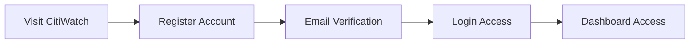
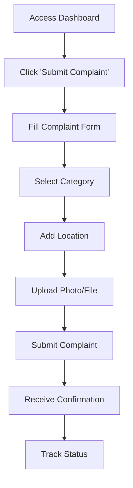
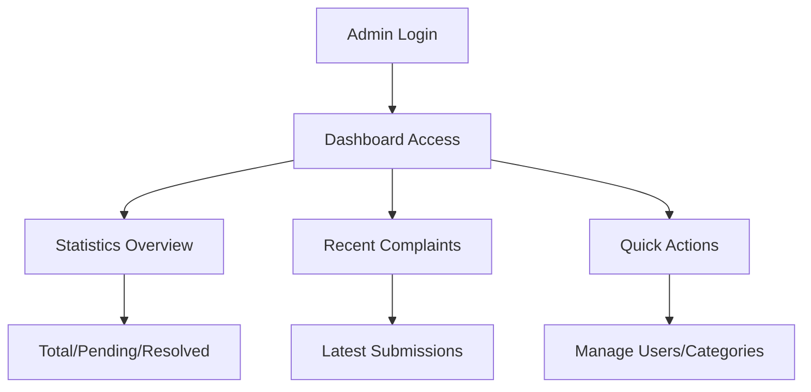
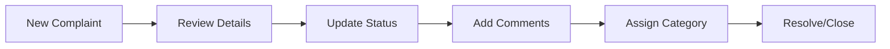

# CitiWatch 🏙️

### A Comprehensive Civic Complaint Management System


CitiWatch is a modern, full-featured civic complaint management platform that empowers citizens to report municipal issues while providing administrators with powerful tools to track, manage, and resolve complaints efficiently.

## 🌟 Key Features

### 👥 **Dual User System**
- **Citizens**: Submit, track, and manage their civic complaints
- **Administrators**: Full oversight with advanced management capabilities

### 📱 **Interactive Complaint Management**
- Real-time complaint submission with photo/file upload
- Interactive location mapping with coordinates
- Advanced filtering and search capabilities
- Status tracking and updates

### 🗺️ **Location-Based Services**
- Interactive maps powered by Leaflet
- GPS coordinate capture for precise complaint location
- Route directions to complaint locations for administrators

### 🎨 **Modern User Experience**
- Responsive design with mobile-first approach
- Dark theme with smooth animations
- Progressive loading and performance optimization
- Accessibility-compliant interface

---

## 🚀 Demo Credentials

To explore CitiWatch's capabilities, use these demo accounts:

### **Administrator Access**
```
Email: admin123@citiwatch.com
Password: Admin123!Pass
```
*Full access to admin dashboard, user management, and complaint resolution*

### **Regular User Access**
```
Email: user@citiwatch.com
Password: User123
```
*Citizen interface for submitting and tracking complaints*

---

## 🏗️ System Architecture

### **Frontend Stack**
- **Next.js 15.5.2** with App Router and Turbopack
- **React 19.1.0** with TypeScript for type safety
- **TailwindCSS 4.0** for modern, responsive styling
- **TanStack Query** for server state management
- **Leaflet** for interactive mapping

### **Key Libraries**
- `@tanstack/react-query` - Data fetching and caching
- `react-leaflet` - Interactive maps
- `compression` - Performance optimization
- Custom validation and authentication systems

---

## 📖 User Journey

### 🙋‍♂️ **Citizen Experience**

#### 1. **Registration & Authentication**


- Navigate to registration page
- Fill out personal information (name, email, password)
- Comprehensive validation ensures data integrity
- Immediate access upon successful registration

#### 2. **Complaint Submission Process**


**Detailed Steps:**
1. **Access Submit Form**: Navigate to `/dashboard/submit`
2. **Complaint Details**:
   - **Title**: Brief description (5-200 characters)
   - **Description**: Detailed explanation (10-2000 characters)
   - **Category**: Select from predefined categories
3. **Location Capture**:
   - Click location on interactive map
   - GPS coordinates automatically captured
   - Address details populated
4. **File Upload**:
   - Support for images and documents
   - Maximum 10MB file size
   - Multiple format support (JPG, PNG, PDF, etc.)
5. **Submission**: Real-time validation and submission

#### 3. **Complaint Tracking**
- **Dashboard Overview**: View all submitted complaints
- **Status Updates**: Real-time status changes
- **Communication**: View admin responses and updates
- **History**: Complete complaint timeline

### 👨‍💼 **Administrator Experience**

#### 1. **Admin Dashboard Overview**


**Key Metrics Displayed:**
- Total registered users and new registrations
- Complaint statistics (total, pending, in-progress, resolved)
- Monthly trends and analytics
- Category distribution

#### 2. **Complaint Management Workflow**


**Management Features:**
- **Complaint List**: Comprehensive view with filtering
- **Status Management**: Update complaint status (Submitted → In Progress → Resolved)
- **Location Services**: View complaint location, get directions
- **Communication**: Add updates and responses
- **Bulk Operations**: Manage multiple complaints

#### 3. **User Management**
- **User Directory**: View all registered users
- **User Profiles**: Access individual user information
- **Complaint History**: View user's complaint history
- **Account Management**: Create/edit/delete user accounts
- **Role Assignment**: Manage user permissions

#### 4. **Category Management**
- **Create Categories**: Add new complaint categories
- **Category Organization**: Manage complaint classifications
- **Usage Analytics**: View category usage statistics

---

## 🛠️ Technical Implementation

### **Authentication System**
- Secure token-based authentication
- Role-based access control (User/Admin)
- Protected routes and API endpoints
- Automatic session management

### **Data Management**
- **TanStack Query** for efficient data fetching
- Real-time data synchronization
- Optimistic updates for better UX
- Comprehensive error handling

### **File Handling**
- Secure file upload system
- Multiple format support
- Size validation and optimization
- Cloud storage integration ready

### **Responsive Design**
- Mobile-first approach
- Tablet and desktop optimized
- Touch-friendly interface
- Accessibility compliance (WCAG 2.1)

---

## 🎯 Core Functionality

### **Complaint Lifecycle**
1. **Submission**: Citizen submits complaint with details and location
2. **Review**: Admin reviews and categorizes complaint
3. **Processing**: Status updated to "In Progress"
4. **Resolution**: Admin resolves issue and updates status
5. **Closure**: Complaint marked as "Resolved" with summary

### **Real-time Features**
- Instant status updates
- Live complaint counting
- Dynamic filtering and search
- Progressive loading

### **Location Services**
- Interactive map integration
- GPS coordinate capture
- Address geocoding
- Route calculation for administrators

---

## 📊 Admin Dashboard Features

### **Analytics & Reporting**
- **Complaint Statistics**: Total, pending, resolved counts
- **User Analytics**: Registration trends, active users
- **Category Analysis**: Most reported issue types
- **Time-based Reports**: Monthly/weekly complaint trends

### **Management Tools**
- **Bulk Operations**: Update multiple complaints
- **Advanced Filtering**: Filter by status, category, date, user
- **Export Capabilities**: Download reports and data
- **Search Functionality**: Find specific complaints or users

### **Quick Actions**
- Direct links to pending complaints
- User management shortcuts
- Category management access
- System administration tools

---

## 🔧 Installation & Setup

### **Prerequisites**
- Node.js 18+ 
- npm or yarn
- Git

### **Installation Steps**

1. **Clone Repository**
```bash
git clone https://github.com/Crowntec/CitiWatch.git
cd CitiWatch/citiwatch
```

2. **Install Dependencies**
```bash
npm install
```

3. **Environment Setup**
```bash
# Copy environment template
cp .env.example .env.local

# Configure your environment variables
# API endpoints, authentication keys, etc.
```

4. **Development Server**
```bash
npm run dev
```

5. **Production Build**
```bash
npm run build
npm start
```

### **Environment Variables**
```env
# API Configuration
NEXT_PUBLIC_API_BASE_URL=your_api_endpoint
NEXT_PUBLIC_MAP_API_KEY=your_map_api_key

# Authentication
NEXT_PUBLIC_AUTH_SECRET=your_auth_secret

# File Upload
NEXT_PUBLIC_MAX_FILE_SIZE=10485760
```

---

## 📱 API Integration

### **Authentication Endpoints**
- `POST /api/User/Login` - User login
- `POST /api/User/Create` - User registration
- `GET /api/User/Profile` - Get user profile

### **Complaint Management**
- `GET /api/Complaint/GetAll` - Get all complaints
- `GET /api/Complaint/GetById/{id}` - Get specific complaint
- `POST /api/Complaint/Submit` - Submit new complaint
- `PUT /api/Complaint/UpdateStatus/{id}` - Update complaint status

### **User Management** (Admin)
- `GET /api/User/GetAll` - Get all users
- `PUT /api/User/Update/{id}` - Update user profile
- `DELETE /api/User/Delete/{id}` - Delete user account

### **Category Management**
- `GET /api/Category/GetAll` - Get all categories
- `POST /api/Category/Create` - Create new category
- `PUT /api/Category/Update/{id}` - Update category

### **Status Management**
- `GET /api/Status/GetAll` - Get all status types
- `POST /api/Status/Create` - Create new status
- `PUT /api/Status/Update/{id}` - Update status

---

## 🎨 Design System

### **Color Palette**
- **Primary**: Blue tones for trust and reliability
- **Secondary**: Green for success, Yellow for warnings
- **Background**: Dark gradient for modern appeal
- **Accent**: Purple for admin features

### **Typography**
- **Headers**: Bold, clear hierarchy
- **Body**: Readable, accessible font sizes
- **Code**: Monospace for technical elements

### **Components**
- **Buttons**: Hover effects and loading states
- **Forms**: Comprehensive validation feedback
- **Cards**: Consistent spacing and shadows
- **Modals**: Centered, accessible overlays

---

## 🔒 Security Features

### **Authentication**
- Secure token-based authentication
- Password strength validation
- Session timeout management
- Role-based access control

### **Data Protection**
- Input validation and sanitization
- XSS protection
- CSRF protection
- Secure file upload handling

### **Privacy**
- User data encryption
- Secure storage practices
- Privacy-compliant data handling
- GDPR considerations

---

## 📈 Performance Optimization

### **Frontend Optimization**
- **Next.js App Router** for optimal routing
- **Turbopack** for faster development builds
- **Code splitting** for reduced bundle sizes
- **Image optimization** with Next.js Image component
- **Progressive loading** for better perceived performance

### **Caching Strategy**
- **TanStack Query** for intelligent data caching
- **Service Worker** for offline functionality
- **CDN integration** for static assets

### **Bundle Analysis**
```bash
npm run analyze
```

---

## 🧪 Testing Strategy

### **Component Testing**
- React Testing Library for component tests
- Jest for unit testing
- Comprehensive form validation testing

### **Integration Testing**
- API integration testing
- Authentication flow testing
- User journey testing

### **Performance Testing**
- Lighthouse audits
- Core Web Vitals monitoring
- Load testing for scalability

---

## 🚀 Deployment

### **Vercel (Recommended)**
1. Connect GitHub repository
2. Configure environment variables
3. Automatic deployments on push

### **Manual Deployment**
```bash
npm run build
npm start
```

### **Docker Deployment**
```dockerfile
FROM node:18-alpine
WORKDIR /app
COPY package*.json ./
RUN npm ci --only=production
COPY . .
RUN npm run build
EXPOSE 3000
CMD ["npm", "start"]
```

---

## 🤝 Contributing

We welcome contributions to CitiWatch! Here's how you can help:

### **Development Setup**
1. Fork the repository
2. Create a feature branch
3. Make your changes
4. Add tests if applicable
5. Submit a pull request

### **Code Standards**
- TypeScript for type safety
- ESLint for code quality
- Prettier for code formatting
- Conventional commits for clear history

### **Areas for Contribution**
- New features and enhancements
- Bug fixes and improvements
- Documentation updates
- Performance optimizations
- Accessibility improvements

---

## 📄 License

This project is licensed under the MIT License - see the [LICENSE](LICENSE) file for details.

---

## 🙏 Acknowledgments

- **Next.js Team** for the excellent framework
- **TailwindCSS** for the utility-first CSS framework
- **Leaflet** for the interactive mapping solution
- **TanStack** for the powerful data management tools

---

## 📞 Support & Contact

- **GitHub Issues**: [Report bugs or request features](https://github.com/Crowntec/CitiWatch/issues)
- **Documentation**: [Wiki and guides](https://github.com/Crowntec/CitiWatch/wiki)
- **Community**: [Discussions and Q&A](https://github.com/Crowntec/CitiWatch/discussions)

---

## 🔮 Roadmap

### **Upcoming Features**
- [ ] Mobile app development
- [ ] Push notifications
- [ ] Advanced analytics dashboard
- [ ] Multi-language support
- [ ] API rate limiting
- [ ] Advanced user roles
- [ ] Integration with municipal systems
- [ ] AI-powered complaint categorization

### **Long-term Vision**
- Smart city integration
- IoT device connectivity
- Predictive analytics
- Community engagement features
- Public transparency portal

---

**Made with ❤️ by the CitiWatch Team**

*Empowering communities through technology, one complaint at a time.*
